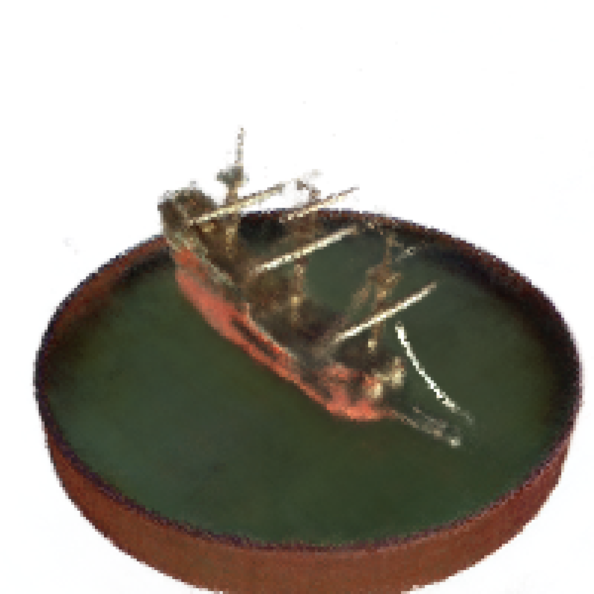

# NeRF
# Project 2: Building Built in Minutes: Phase 2
## NeRF

### Authors
- **Dhrumil Kotadia**  
  Robotics Engineering Department  
  Worcester Polytechnic Institute  
  Worcester, Massachusetts

### Introduction
In this report, we will provide a comprehensive analysis of our implementation of the NeRF network. NeRF, short for Neural Radiance Fields, embodies a sophisticated framework encapsulated within a fully connected network architecture. This neural network operates seamlessly, with its input characterized by a unified continuous 5D coordinate system, encompassing spatial positions denoted by (x, y, z), coupled with viewing directions represented by \((\theta, \psi)\) and provides the volume density and the RGB pixel values corresponding precisely to the provided viewing direction as outputs. We use the lego and the ship dataset from the official dataset obtained from the original author.

NeRF uses classical volume Rendering techniques where we consider each point to be a ray that starts from the camera center and passes through the pixel to the world.

Let’s talk about the premise of the paper. You have images of a particular scene from a few specific viewpoints. Now you want to generate an image of the scene from an entirely new view. This problem falls under novel image synthesis. The immediate solution to novel view synthesis that comes to our mind is to use a Generative Adversarial Network (GAN) on the training dataset. With GANs, we are constraining ourselves to the 2D space of images. The next question asked is "Why not capture the entire 3D scenery from the images itself?" We are now looking at a transformed problem statement. From novel view synthesis, we have transited to 3D scene capture from a sparse set of 2D images.

This new problem statement will also serve as a solution to the novel view synthesis problem. How difficult is it to generate a novel view if we have the 3D scenery at our hands? Note that, NeRF is not the first to tackle this problem. Its predecessors have used various methods, including Convolutional Neural Networks (CNN) and gradient-based mesh optimization. However, according to the paper, these methods could not scale to better resolution due to higher space and time complexity. NeRF aims at optimizing an underlying continuous volumetric scene function.

### Background and Dataset Structure
Imagine this. You are out with your camera and spot a beautiful flower. You think about the way you want to capture it. Now it is time to orient the camera, calibrate the settings, and click the picture. This entire process of transforming the world scene into an image is encapsulated in a mathematical model commonly called the forward imaging model. We can visualize the model in Figure 1.

The forward imaging model starts from a point in the world coordinate frame. We then transform this to the camera coordinate frame using coordinate transformation. After that, we use projection transformation to transform the camera coordinates onto the image plane.

After unzipping the dataset, you will find three folders containing images: train, val, and test, and three files containing the orientation and position of the camera: `transforms_train.json`, `transforms_val.json`, and `transforms_test.json`. The json file has two parent keys called `camera_angle_x` and `frames`. We see that `camera_angle_x` corresponds to the camera’s field of view, and `frames` are a collection of metadata for each image (frame). Each frame is a dictionary containing two keys, `transform_matrix` and `file_path`. The `file_path` is the path to the image (frame) under consideration, and the `transform_matrix` is the camera-to-world matrix for that image.

### Method
We begin with a sparse set of images and their corresponding camera metadata (orientation and position). Next, we want to achieve a 3D representation of the entire scene. The steps for NeRF can be visualized in the following steps:

- **Generate Rays:** In this step, we march rays through each pixel of the image.
- **Generate Sample Points:** In this step we sample points (\(a_1, a_2, a_3, \dots, a_n\)) on the rays. We must note that these points are located on the rays, making them 3D points inside the box. This is done for each batch before providing as an input to the network. Each point has a unique position (x, y, z) and a direction component \(\alpha\) linked. The direction of each point is the same as the direction of the ray.
- **Positional Encoding:** Positional Encoding is a popular encoding format used in architectures like transformers. This paper suggests that deep networks are biased toward learning low-frequency functions. To bypass this problem NeRF proposes mapping the input vector (x, y, z, \(\theta\), \(\phi\)) to a higher dimensional representation. Since the 5D input space is the position of the points, we are essentially encoding the positions from which it gets the name.
- **Deep Learning:** We pass these points into a Multi-Layer Perceptron (MLP) and predict the color and density corresponding to that point.
- **Volume Rendering:** Let’s consider a single ray and send all the sample points to the MLP to get the corresponding color and density. After we have the color and density of each point, we can apply classical volume rendering to predict the color of the image pixel through which the ray passes.
- **Photometric Loss:** The difference between the predicted color of the pixel and the actual color of the pixel makes the photometric loss. This eventually allows us to perform backpropagation on the MLP and minimize the loss.

### Ray Generation
As discussed in the previous section, we generate rays passing through each pixel. These rays, defined by their origins (camera positions) and directions (pixel coordinates), serve as probes into the scene's volumetric structure. By systematically sampling along these rays at discrete intervals, NeRF gathers information about the scene's geometry and appearance. This comprehensive sampling strategy enables NeRF to reconstruct intricate details and capture subtle nuances within the scene, facilitating the synthesis of realistic and immersive visualizations. We have specified the near and far bounds as 2 and 6 respectively, to form a cube inside which the 3D structure lies. For training, we have considered 256 sample points on each ray lying between the near and far bounds. After getting these samples, we perturb the samples a little randomly which enables us to have a more even spread throughout the ray. These sample points are then passed to the model.

### Network
We have used the network mentioned in the official NeRF paper but we have only used one network instead of both coarse and fine networks. The architecture can be seen in figure 2.

The implementation is a fully connected network and has hidden layers with 256 channels each and a ReLU after it. After 4 layers, there is a skip connection that concatenates the input to the fifth layer. An additional layer outputs the density and is then concatenated with the viewing direction. It is then processed by an additional fully connected layer with 128 channels which gives the RGB output. For dataloading, we read all the images of the train or test set provided and convert them to a lower resolution (200x200) for faster computation. We then generate rays for all the images, convert them to 2D tensors and provide them to the torch dataloader which will provide all the values according to the batch size as an input for the network. In the network, firstly, all sample points are calculated for each ray provided by the dataloader, positional encoding is done and then the data is given to the network. The MSE loss function is used to calculate the loss based on the output generated by the network. Renderer is used to render the output generated by the network.

- **Number of samples per ray:** 256
- **Learning rate:** 0.0005
- **Optimizer:** Adam
- **Loss:** MSE loss
- **Near, Far bounds:** 2, 6

### Outputs
The Peak signal to noise ratio (PSNR) and Structural index similarity (SSIM) are the two measuring tools that are widely used in image quality assessment. The values obtained after 10 Epochs (resource constraint) are shown in figure 3. Also the data are listed in the table below.

| Method | Loss |
| ------ | ---- |
| Peak signal to noise ratio (PSNR) | 18.11 |
| Structural index similarity (SSIM) | 0.49 |

The outputs of the Test set for the Lego dataset can be seen in figure 4. The rendered images are compared with the ground truth and it is evident that the network does an adequate job of reproducing the novel views.

   
   
 

However, this is done using positional encoding. Without positional encoding, the outputs are less than desirable as can be seen in figure 5.

 

The output images for the ship dataset are shown in figure 6.

   
   
 

### Observations
An observation is that with the same pretrained model, when the test images are queried with different sample points per rays, the output changes drastically. This can be seen in figure 7.

 

Another observation is that there are some rendered images which have artifacts that are undesirable. These can be seen in figure 8.

 

Overall, looking at the Lego and the Ship rendered outputs, it can be seen that the results are adequate but can be improved. There are 2 main improvements that can be done here:

1. The image resolution is reduced to (200x200) from the original (800x800). This is done to reduce the training time but as a result of this, the output resolution is less so the image does not have the sharpness and clarity that is expected.
2. The training can be done for more epochs to improve the output and to get rid of the artifacts that have been generated.

### Conclusion
It can be concluded that the NeRF network can generate the novel views based on the input train images and can generate a gif of the object in consideration in 3D. NeRF is an example of groundbreaking research in both Deep Learning and Computer Graphics. It advances the field a great deal by achieving results that very few methods have been able to do thus far.

### References
- Original NeRF Paper
- [Rahaman et al., 2019](https://arxiv.org/abs/1906.05336)
 

## Installation

To run the code, install all the necessary packages.

1. PyTorch
2. PIL
3. Numpy
4. tqdm
5. time
6. Matplotlib

## Usage

Follow the steps to run the code:

1. Set the Hyperparameters like Batch_Size, Learning_Rate, Step_Size, Epochs etc. in Wrapper.py using command line arguments.
2. Set the appropriate paths for Training data in the Wrapper.py and FetchData.py.
3. Run the file Wrapper.py.
4. For testing, provide the appropriate paths for trained model, Rendered Image file generation and Gif generation in Test.py.
5. Run Test.py to generate the output.

